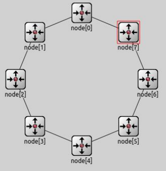
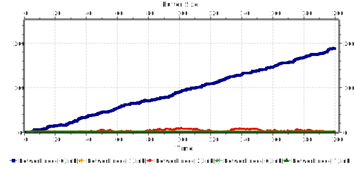
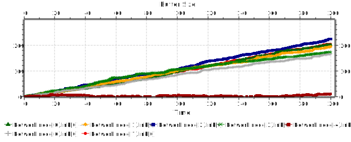
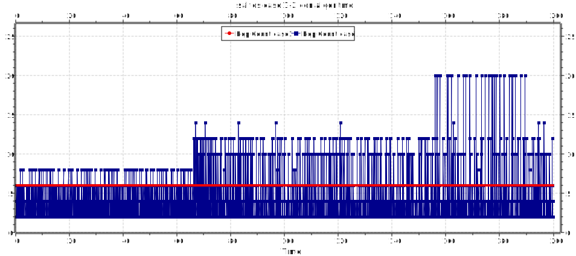

## Título:
Análisis basado en algoritmo de ruta más corto con un grafo estático (modelo de anillo).

# Integrantes: 
* Beckford, Mauricio Germán
* Bettinotti, Ivan
* Menendez, Hilario

## Abstract o resumen:
En el siguiente trabajo se pretende analizar como decidir por que ruta se envían los paquetes, los problemas que pueden surgir y posibles soluciones. También se presenta un algoritmo de enrutamiento para redes de computadoras muy simple, pero que para una red con forma de anillo, como en la figura 1, funciona de manera razonable. El mismo se basa en encontrar el camino con la menor cantidad de saltos hacia el destino teniendo en cuenta el tamaño de los buffer de sus vecinos. Todos los nodos comunican el tamaño de su buffer a sus vecinos cada t segundos al alcanzar cierto limite.

###         fig. 1

###         fig. 2

## Introducción:
La capa de red, es un nivel o capa que proporciona conectividad y selecciona la ruta entre dos sistemas de hosts que pueden estar ubicados en redes geográficamente distintas. Su misión es conseguir que los datos lleguen desde el origen al destino aunque no tengan conexión directa. Ofrece servicios al nivel superior (nivel de transporte) y se apoya en el nivel de enlace, es decir, utiliza sus funciones. Puede asignar direcciones de red únicas, interconectar subredes distintas, encaminar paquetes, utilizar un control de congestión y control de errores.
El enrutamiento es aquella parte del software de la capa de red responsable de decidir por cuál línea de salida se transmitirá un paquete entrante.

Para el trabajo contamos con una red de tipo anillo. Cada nodo de la red está compuesto por tres capas. La capa de aplicación en donde se generan y procesan los paquetes. La capa de red donde los paquetes pueden provenir de dos orígenes distintos, de la capa de aplicación o bien de algún enlace (figura 2). Aquí se toma la decisión de enviar el paquete a otro nodo a través de la capa de enlace, o enviarlo a la aplicación para su procesamiento. Por ultimo, la capa de enlace se encarga de comunicarse con los demás nodos. A continuación se estudiarán dos casos diferentes.

## Metodos
En ambos contamos con una red compuesta por 8 nodos como los descritos anteriormente,donde cada uno de ellos consta de dos interfaces de comunicación full-duplex que lo conecta con sus vecinos, y un algoritmo de enrutamiento de capa muy simple. Las simulaciones tienen una duración de 200 segundos, la generación de paquetes es controlada por una distribución exponencial centrada en 0.1 y el tamaño de los paquetes es de 12.500 bytes.

# Caso de estudio 1:
Las configuraciones de la simulación son las siguientes:
El nodo5 es el único nodo destino, es decir, todos los paquetes generados son destinados a el. El nodo0 y el nodo2 son los nodos generadores, encargados de crear el trafico de la red. Del total de paquetes generados, solo la mitad alcanzo su destino.

Los datos explícitos:
Cantidad de paquetes generados nodo1: 1961
Cantidad de paquetes generados nodo2: 1957
Cantidad de paquetes entregados a destino: 1996
Mínima cantidad de saltos: 3
Máxima cantidad de saltos: 5

Otras métricas indican el tiempo que tardan los paquetes en llegar a destino, este va creciendo a medida que el tiempo de simulación aumenta. En punto de congestión se encuentra claramente en el nodo0, el cual contiene una cantidad considerablemente superior superior de paquetes que la cola del nodo2. Esto se debe a que el nodo0 no sólo genera sino que también debe recibir los paquetes que vienen por su izquierda (los generados por el nodo2). Como consecuencia su cola crece rápidamente. De estos datos se deduce que la red no esta utilizando sus recursos eficientemente. El problema esta en la distribución de los paquetes, toda la carga de la red descansa sobre un solo nodo, mientras que los restantes apenas se esfuerzan.

###         fig. 3

# Caso de Estudio 2: 
Las configuraciones de la simulación son las siguientes:
El nodo5 sigue siendo el único destino.

Todos los nodos a excepción del nodo5 son generadores.

En este caso solo el 14% de los paquetes generados fueron recibidos por el nodo5. A diferencia del caso anterior el intervalo de salto de los paquetes es [1, 7]. Otras métricas indican el tiempo que tardan los paquetes en llegar a destino, este va creciendo a medida que el tiempo de simulación aumenta. Podemos observar que el único nodo que no se satura rápidamente es el nodo4 (figura 4). Este únicamente genera paquetes y los envía al nodo3, esto deja en evidencia el trabajo adicional que significa para un nodo el cumplir con un papel tanto de emisor como de receptor/enrutador en la red. La cantidad de paquetes que quedó en tránsito al finalizar la simulación es muy grande. Al hacer el experimento con estos valores la red está completamente saturada y sólo se ha logrado entregar un porcentaje muy pequeño del total.

###         fig. 4

Algo que cabe destacar es que al estar todos los nodos generando paquetes se penaliza a los nodos que se encuentran más lejos del nodo destino y favorece a los más cercanos. Esto último se observa al analizar que si bien llegaron paquetes de todos los nodos el promedio de saltos, 2, es bajo y la desviación estándar es de tan sólo 1.3284, esto quiere decir que hay poca dispersión en los valores medidos respecto al promedio. De las mediciones de demoras de paquetes se puede ver que el paquete que más tardó en llegar estuvo casi todo el tiempo de simulación siendo demorado por la creciente congestión en los nodos por los que transito. Si pensamos en el delay máximo y mínimo nos damos cuenta que probablemente el mínimo pertenece a los paquetes del nodo6. El máximo, en cambio, fue creado en algún nodo distante por izquierda y que paso gran parte de su vida dentro de los buffer de otros nodos. Se encontró que la red se estabiliza con un interArrivalTime de 3.19. Con esta configuración casi el 100% de los paquetes generados fueron procesados por el nodo destino. Además, las colas de los nodos no presentaron crecimiento y los tiempo de llegada se mantuvieron al mínimo. Con estos cambios hemos conseguido aliviar el retraso de los paquetes considerablemente. No hay mucho que decir respecto a los saltos. El hecho de que se hayan entregado prácticamente todos los paquetes nos dice la congestión dejo de ser un problema, esto se debe a que el tiempo de generación es mas grande que el tiempo que tardan los paquetes en viajar, ser enrutados y procesados.

## Descripción del algoritmo

Cada enrutador tiene en memoria una estructura de datos que le permite guardar el estado de los buffer de sus vecinos. Cuando la utilización del buffer de un enrutador supera un cierto limite, se envı́a un paquete informando con tamaño actual de su buffer a cada uno de sus vecinos, este tiene un tipo distinto de 0 y un identificador del emisor. Un paquete de información es enviado cada t tiempo para evitar la congestión. Si un enrutador recibe un paquete de tipo distinto de 0, sabe que es un paquete de información y no de datos. Luego de extraer la información y guardarla el paquete es destruido. La situación descrita es denominada proceso de actualización del estado de los nodos vecinos, teniendo esta información, una vez que un enrutador recibe un paquete de datos ejecuta una de las siguientes opciones: Cuando un paquete de datos es recibido se calcula el camino con menor cantidad de saltos hacia el destino. Teniendo el camino mas corto, se verifica si el camino por el que se va a enviar el paquete no este desbalanceado, un camino esta desbalanceado si la diferencia en el tamaño de los buffer de los vecinos excede cierta cantidad. Es decir, si el vecino 'x' tiene 'z' cantidad mas paquetes en su cola que el vecino y, donde 'z' es mayor que el limite de diferencia, entonces el paquete seria enviado por 'y' incluso si el camino mas corto sea pasando por x. Esta lógica nos permite balancear el trafico de la red, si un nodo esta recibiendo demasiados paquetes, y otro muy pocos, la red se balanceara y comenzara a enviar paquetes al nodo menos utilizado

A continuación se analizara el comportamiento del algoritmo bajo los dos casos de estudio detallados anteriormente. Esta vez utilizamos el algoritmo de enrutamiento. El tamaño de los paquetes de información(feedback) es de 20 bytes.

# Caso de estudio 1:
Las configuraciones de la simulación son idénticas a las del Caso de Estudio 1 anterior, con la diferencia que ahora se utilizará el algoritmo de enrutamiento.
En contraste con el caso anterior, en donde solo la mitad de los paquetes generados fueron recibidos, podemos observar que casi la totalidad de los paquetes generados fueron recibidos. Ningún paquete de feedback fue creado, esto se debe a que las colas no llegaron al umbral establesido (figura 5). La cantidad de saltos se mantuvo constante en 6 (figura 6). Anteriormente el delay máximo fue 5, en este caso es solo 3, con la mayoría de los paquetes teniendo un retardo menor a 2. Vemos que cuando se hace un mejor uso de los recursos de la red y se balancean las cargas el rendimiento en general aumenta.

###         fig. 5

###         fig. 6

# Caso de estudio 2:
Ahora la configuraciones de la simulación son idénticas a las del Caso de Estudio 2 anterior, pero con el algoritmo de enrutamiento.

Ahora que existe una mayor cantidad de nodos generadores. En esta situación el algoritmo comienza a degradarse. Viendo el gráfico 6 podemos ver que solo 4.000 de los 14.000 paquetes generados fueron recibidos. Comparado a casi el 100 % del caso anterior, ahora solo pudimos cumplir con el 28 % de los paquetes generados. Los pocos paquetes de información creados ayudaron a controlar el crecimiento de las colas (figura 7). El la figura se muestra la distribución de los paquetes de la red. La cantidad de saltos sufrió un incremento, llegando a un máximo de 20 y una media de 4 (figura 6). En consecuencia el delay de los paquetes llego a una media de 54.

###         fig. 7

Por último, en la figura 8 y 9 pueden apreciarce como fue la distribucion de los paquetes en cada caso.

###         fig. 8

###         fig. 9

# Conclusión

Claramente una vez que se comparan las metricas obtenidas de los experimentes con y sin algoritmo de enrutamiento se nota que hubo una mejora significante en la cantidad paquetes que llegaron a destino, la cantidad de saltos y su delay. Esto es consecuencia directa del balanceo de la red. Existen casos donde pueden ocurrir loops de enrutamiento. En el caso de que se den loops en el enrutamiento se solucionan teniendo en cuenta la cantidad de saltos que realizo el paquete que se debe enrutar, si tiene mas de 6 saltos se enviara siempre por la misma dirección es decir, vuelve a implementar el algoritmo de enrutamiento utilizado en la Tarea de Análisis. Existe un amplio espacio de mejora, el algoritmo deberı́a poder adaptarse a otros tipos de topologias con pocos cambios en el código, por ejemplo, en lugar de destruir el paquete de información este se podrı́a transmitir a sus vecinos N veces. Es decir, cada vecino recibe el paquete, agrega su información y lo reenvı́a a sus demás vecinos, este proceso se repetirı́a N cantidad veces, esta información podria permitirle a los nodos contener una tabla de adyacencia y emplearla para la toma de desiciones. Para un mejor tiempo de respuesta frente a buenas noticias, los nodos podrı́an enviar un mensaje de información indicando que su buffer cayo por debajo del nivel critico. Se deberı́a aprovechar la modularidad, los nodos no tienen porque conocer el estado de la totalidad de la red, saber el área próxima a ellos seria suficiente. Se deberı́an evitar parámetros fijos, por ejemplo, la cantidad de saltos que debe tener un paquete para ser enviado forzadamente por una dirección, la cantidad de paquetes que dispara la acción de enviar un paquete de información o el intervalo en que se envı́an. Todos estos parámetros deberı́an ser flexibles y adaptarse al comportamiento de la red permitiendo una mejor escalabilidad y flexibilidad. Ademas, se deberı́a tener en cuenta el caso donde algún nodo se apague, ¿Como calculamos ahora los nuevos caminos?, ¿Deberı́amos penalizar ese camino una vez que el nodo vuelva a estar en linea?. Enviar la información de los buffer dentro de los paquetes de información seria una forma de evitar congestionamiento indeseado en la red.

Las conclusiones anteriores son teniendo en cuenta que lo que se prefiere que la red se adapte automaticamente a distintos tamaños y topologias. Esto siempre conlleva un incremento en el costo de trafico en la red, considerando las dimensiones y complejidades que pueden alcanzar estos dos parametros este costo es despreciable. En pocos casos se recomendaria un enrutamiento estatico por sobre uno dinamico.